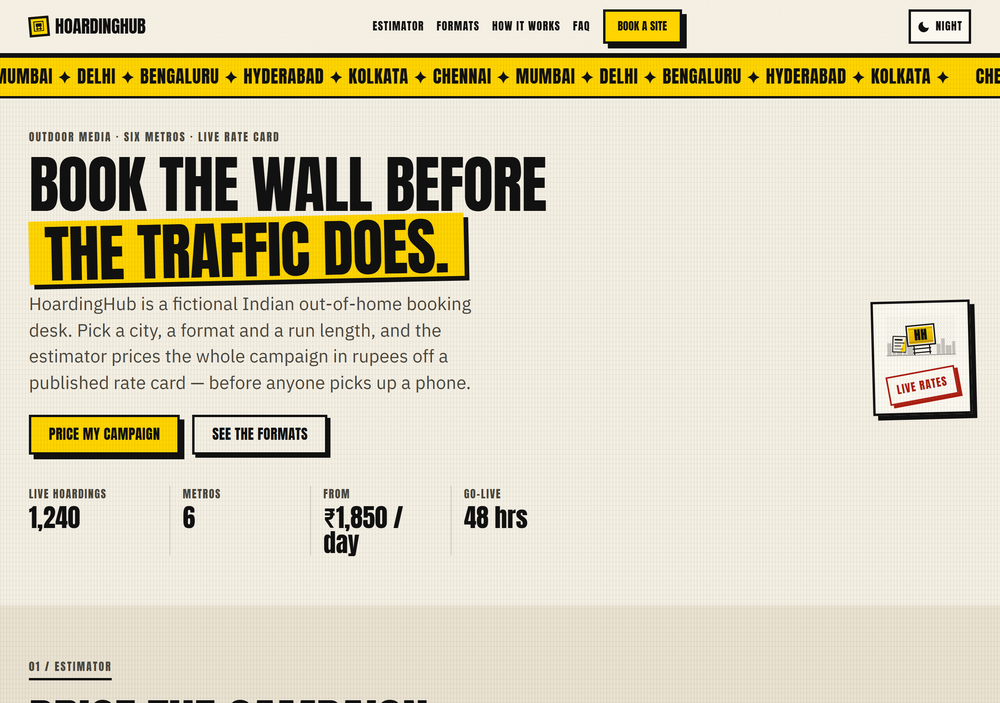
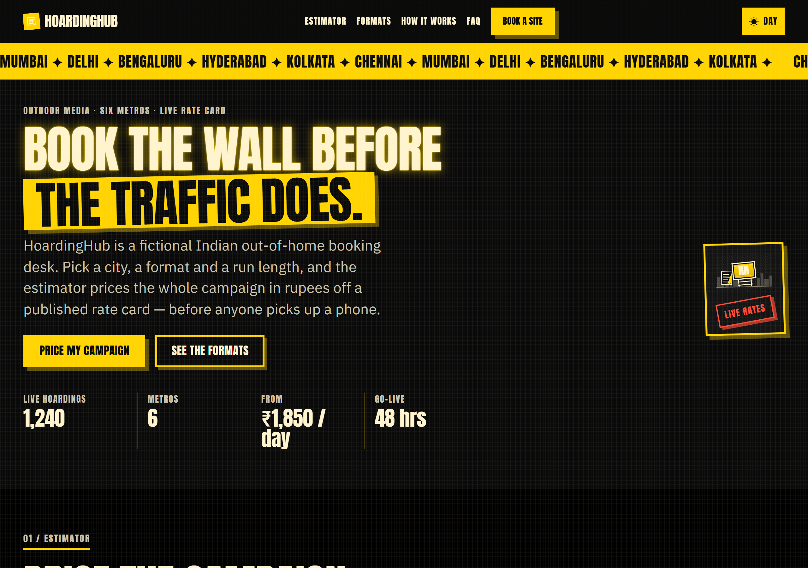
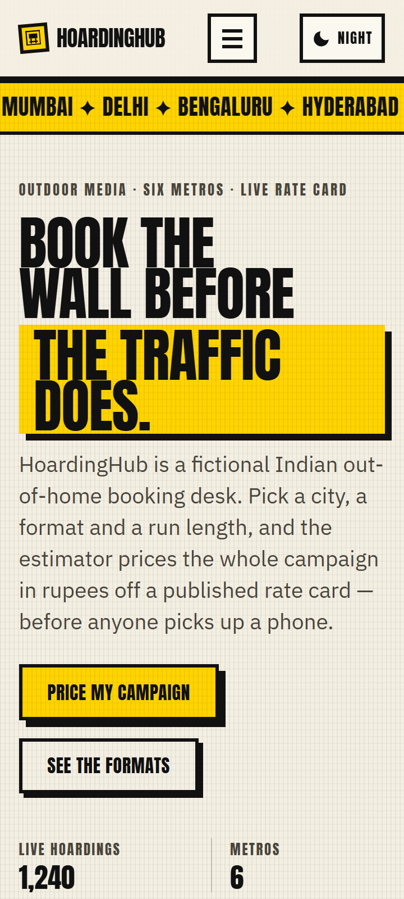

# HoardingHub

**Live demo:** <https://vinoth1121.github.io/HoardingHub/> · **Source:** <https://github.com/vinoth1121/HoardingHub>








A working campaign estimator for outdoor ad space across six Indian cities, priced live in rupees, with no build step and zero dependencies.

## Why this is different

- **The estimator actually works.** It is not a fake form with a hardcoded number. `js/data.js` is a documented rate table of city multipliers and per-format day rates, impression ranges and unit labels; `js/estimator.js` runs the arithmetic against it in pure functions and only then binds to the DOM. Change a rate and every dependent figure moves.
- **State lives in the URL query string.** Every estimate is shareable and bookmarkable. Pick a city, format, duration and budget and you land on `?city=delhi&format=digital-screen&days=14&budget=100000`; the page reads it on load and rewrites it as you change controls, via `history.replaceState`, so the back button is not spammed with a hundred entries.
- **Zero dependencies.** No framework, no bundler, no build step, no `npm install`. Clone the repo and open it.

## Stack

Vanilla HTML5 in a single `index.html`, CSS3 using custom properties, a 12-column asymmetric grid, flexbox and `clamp()` for the type scale, and ES modules served as-is with no transpile. Tests run on Node's built-in test runner (`node:test`) with zero dependencies. Hosting is GitHub Pages, serving the `main` branch root.

The only build-adjacent tooling in the repo is `node --test`, and nothing at all is required to run the site.

| Path | What it does |
| --- | --- |
| `index.html` | Markup for all 8 sections |
| `css/tokens.css` | The only file allowed to contain literal colours |
| `css/fonts.css` | Self-hosted `@font-face` plus metric-compatible fallbacks |
| `css/base.css` | Reset, type scale, focus rings, reduced-motion |
| `css/layout.css` | 12-col asymmetric grid, drawer positioning, ticker |
| `css/components.css` | The skin on every component |
| `assets/fonts/*.woff2` | The four self-hosted subsets, two families × `latin` and `latin-ext` |
| `js/data.js` | Frozen illustrative rate card |
| `js/estimator.js` | Pure quote engine + the DOM binding |
| `js/form.js` | Validation, success state, mailto fallback |
| `js/theme.js` | Night-billboard toggle |
| `js/nav.js` | Sticky nav, focus-trapped drawer, Esc to close |
| `js/main.js` | Single entry point that wires it all together |
| `test/estimator.test.js` | 46 unit tests, `node:test`, zero dependencies |

## Run locally

This is a static site with no server requirement, but ES modules will not load over `file://` — the module loader is subject to CORS and `file://` gives it no origin to satisfy. So if you already run a local server, point it at the repo root and open `index.html` through it. Otherwise:

```powershell
python -m http.server 8000
# then open http://localhost:8000
```

Run the tests:

```powershell
node --test "test/**/*.test.js"
```

The quoting is required on Node 24. The test runner expands the pattern itself, recursively; unquoted, a shell that treats `**` as a single `*` collapses it to `test/*/*.test.js`, which does not match a file sitting directly in `test/` and silently collects nothing.

## Lighthouse

Lighthouse 13.5.0, run against the live URL on both the mobile and desktop presets. All four categories score 100 on both form factors.

| Category | Mobile | Desktop |
| --- | --- | --- |
| Performance | 100 | 100 |
| Accessibility | 100 | 100 |
| Best Practices | 100 | 100 |
| SEO | 100 | 100 |
| FCP | 1206 ms | 342 ms |
| LCP | 1551 ms | 422 ms |
| CLS | 0 | 0 |
| TBT | 0 ms | 0 ms |
| Speed Index | 2143 ms | 734 ms |
| Total page weight | 178.4 KB over the wire | same |

Page weight in full: 178.4 KB over the wire (174.2 KiB transfer), 291.2 KB uncompressed, inside the 300 KB budget. 17 requests, all first-party, zero third-party. Fonts are 126,644 B of that, which is 71% of the page.

**The first run scored 83 mobile / 75 desktop.** Root cause was not page weight. `index.html` was loading Anton and IBM Plex Sans from `fonts.googleapis.com`, which made a third-party stylesheet render-blocking (827 ms wasted) and put FCP and LCP on the same chain — FCP == LCP == 2984 ms on mobile. The font swap also produced CLS of 0.128 on the hero headline.

The fix was to self-host the four woff2 subsets onto the same origin, preload the two `latin` files, and add metric-compatible `@font-face` fallbacks (`size-adjust`, `ascent-override`, `descent-override`, `line-gap-override`) so the swap does not reflow. Result: 83 → 100 mobile, 75 → 100 desktop, CLS 0.128 → 0.000, with byte weight unchanged — the CDN had been serving the same four files.

Two details from that work are worth keeping. `latin-ext` is not optional, because U+20B9 (₹) lives in that range rather than `latin`, and dropping it turns every price in the page into tofu. And IBM Plex Sans is a variable font, so requesting fewer weights does not reduce bytes — only subsetting does.

**Browser QA is 25 of 27, not 27 of 27.** A 27-assertion Puppeteer harness runs against production; 25 pass and 2 fail, and both failures are bugs in the harness rather than in the site:

- One assertion is inverted. It computes the result and asserts it is *valid*, which accidentally asserts that `1234567890` — not a valid Indian mobile — passes. The site correctly rejects it, which was confirmed by probing the live DOM rather than by trusting the harness.
- One double-counts `index.html`, because it dedups by exact URL string, so `/` and `/?city=…` become two keys for a single document.

Separately: 46 unit tests, 46 pass and 0 fail. Zero console errors, zero page exceptions, zero failed requests. Verified at 360 / 768 / 1280 in both themes, zero horizontal overflow in all six combinations.

## Accessibility notes

- Skip link to `#main`, hidden until focused.
- Mobile drawer is focus-trapped, receives focus on open, closes on Esc, and is `inert` while closed.
- Estimator results, the warning list and the form status are `aria-live` regions.
- FAQ accordion takes roving arrow keys plus Enter, with Home and End.
- `prefers-reduced-motion` is honoured globally in `base.css`, not per-component.
- Body text meets AA contrast in both themes.
- The booking form never posts anywhere; it composes a `mailto:` as a fallback.

Automated QA found two real defects that are worth naming because they were invisible in review.

The drawer never received focus on open. `#nav-toggle` was clicked, `.is-open` was applied, but `document.activeElement` stayed on the toggle — because `visibility` was still `hidden` mid-transition, and Chrome refuses to focus a `visibility: hidden` subtree. Fixed with a three-way race (double `requestAnimationFrame`, `transitionend`, and a timeout safety net for the reduced-motion case where no transition runs), plus a `focusTicket` guard so a fast re-close cannot steal focus, and a `tabindex="-1"` fallback on the nav itself. WCAG 2.4.3 and 2.4.7.

The stamp-red badges failed WCAG 1.4.3 at 4.38:1 and 4.30:1, against a 4.5:1 requirement, and the budget range input had a 376 × 6 px hit area, failing WCAG 2.5.8. Darkening `--stamp` to `#AC1E12` puts the badges at 5.4–6.7:1, and removing a `-9px` negative margin that was letting the next input overlap the slider brings accessibility to 100.

## What I'd build next

1. **A real rate card behind `js/data.js`.** It is a frozen, illustrative table. It needs to come from a CMS or an API, and the estimator needs to cope with that fetch failing instead of assuming the data is inline.
2. **A backend for the booking form.** Today it validates client-side and then composes a `mailto:`. It needs a real endpoint with the same rules re-run server-side — client-only validation is never trusted — plus spam handling and a success path that does not depend on a mail client being installed.
3. **Commit the Puppeteer harness and test the DOM modules.** Only the pure estimator engine is unit tested; `theme.js`, `nav.js`, `form.js` and `main.js` are exercised solely by a harness that is not in the repo, so regressions in them are invisible to CI. The harness needs its two known bugs fixed first.
4. **Review the print stylesheet.** `base.css` has a print block that has never been looked at. An estimate is exactly the sort of thing people print, and it should not fall off the page.
5. **Then the product work:** multi-city campaigns in one enquiry, availability calendars, and a map view of inventory. All three need the rate card and the endpoint from 1 and 2 to be worth building.

## Licence

MIT. See [`LICENSE`](LICENSE).
